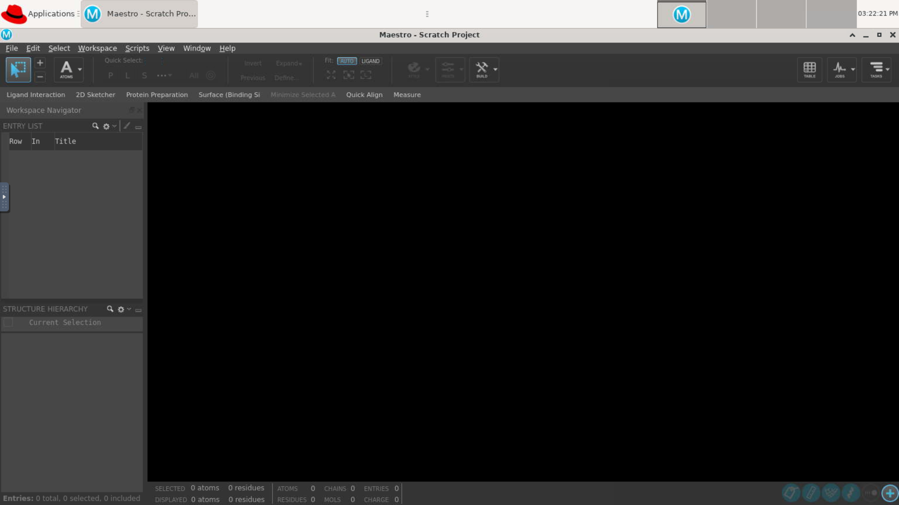

# Batch Connect - OSC Schrodinger


[](https://opensource.org/licenses/MIT)

## Overview

OSC Schrodinger is an interactive app designed for OSC OnDemand that launches Schrodinger in an XFCE desktop. Schrodinger is designed for researchers running molecular modeling.

- Upstream project: [Schrodinger](https://www.schrodinger.com)

## Screenshots



## Features

- Launches Schrodinger via interactive desktop (TurboVNC + XFCE) on compute nodes
- Configurable cores, memory, wall time, and node type via the launch form

## Requirements

### Compute Node Software

- [Schrodinger] 2020.1+
- [Lmod] 6.0.1+ or any other `module purge` and `module load <modules>` based CLI used to load appropriate environments within the batch job before launching the Jupyter server.
- [Xfce Desktop] 4+

For VNC server support:

- [TurboVNC] 2.1+
- [websockify] 0.8.0+

For hardware rendering support: 
- [VirtualGL] 2.3+ 

[VirtualGL]: https://virtualgl.org/
[Lmod]: https://www.tacc.utexas.edu/research-development/tacc-projects/lmod
[Xfce Desktop]: https://xfce.org/
[Schrodinger]: https://www.schrodinger.com/
[TurboVNC]: http://www.turbovnc.org/
[websockify]: https://github.com/novnc/websockify

### Open OnDemand
- Open OnDemand 2.x+ (Batch Connect support required)
- Scheduler: Slurm

## App Installation

### 1. Clone the repository into your Open OnDemand apps directory:

```sh
cd /var/www/ood/apps/sys
git clone https://github.com/OSC/bc_osc_schrodinger.git
cd bc_osc_schrodinger

# Pin to a release (recommended)
git checkout v0.6.0
```

You will not need to do anything beyond this as all necessary assets are
installed. You will also not need to restart this app as it isn't a Passenger app.

To update the app you would:

```sh
cd bc_osc_schrodinger
git fetch
git checkout <tag/branch>
```

Again, you do not need to restart the app as it isn't a Passenger app.

### 2. Configure for your site

Edit `form.yml` and update these values for your cluster:

| Attribute | Default | Change to |
|-----------|---------|-----------|
| `cluster` | `cardinal` | Your cluster name(s) |
| `schrodinger_version` | `2024.3`, `2023.2` | Schrodinger versions on your system via schrodinger/ module |
| `node_type` | OSC-specific node types | Node types available on your cluster |

### 3. Verify

No OOD restart is needed (Batch Connect apps are detected automatically). Visit your OOD dashboard and look for **Schrodinger** under **Interactive Apps > GUIs**.

## Configuration

### form.yml attributes

| Attribute | Description | Default |
|-----------|-------------|---------|
| `cluster` | Target cluster ID | `cardinal` |
| `schrodinger_version` | Schrodinger version to launch via schrodinger/ module| 2024.3 |
| `bc_num_hours` | Maximum wall time (hours) | 1 |
| `bc_num_slots` | Number of scheduler slots requested (number of nodes) | 1 | 
| `num_cores` | Number of CPU cores (1--96, varies by node type/cluster) | 1 |
| `node_type` | Compute node type (any, vis, hugemem) | `any` |
| `licenses` | String with specified licenses for macromodel, glide, ligprep, qikprep, or epik features. | |
| `bc_vnc_resolution` | Resolution of VNC desktop session | 1228 x 691 |

### Environment variables

| Variable | Required | Description |
|-----------|-------------|---------|
| SCHRODINGER | Yes | Path to Schrodinger installation root |
| LM_LICENSE_FILE | Yes | License server or file for Schrodinger |
| VGL_DISPLAY | No | VirtualGL display for GPU rendering |

## Troubleshooting

### Job starts but app doesn't appear (Batch Connect)

1. Check the job's `output.log` in `~/ondemand/data/sys/bc_osc_schrodinger/`
2. Verify the module loads correctly: `module load schrodinger/<version>`
3. Verify the window manager is installed: `which xfwm4`
4. Verify websockify is installed and accessible

### "Module not found" error

The module name in `form.yml` doesn't match your system. Run `module spider software` to find the correct name and update the `modules` attribute.

### Connection timeout

The app may need more time to start. Increase the connection timeout or check that the compute node can open the required port.

## Testing

| Site | OOD Version | Scheduler | Status |
|------|-------------|-----------|--------|
| Ohio Supercomputer Center | 4.1.4 | Slurm | Production |

## Known Limitations

- Licensing for Schrodinger features must be correctly configured and requested

## Contributing

1. Fork this repository
2. Create a feature branch (`git checkout -b feature/my-improvement`)
3. Submit a pull request with a description of your changes

For bugs or feature requests, [open an issue](https://github.com/OSC/bc_osc_schrodinger/issues).

This app is part of the [OOD Appverse](https://ondemand.connectci.org/affinity-groups/ood-appverse). Join the [Appverse Affinity Group](https://ondemand.connectci.org/affinity-groups/ood-appverse) to connect with other contributors.

## References

- [Schrodinger](https://www.schrodinger.com) — the application launched by this OOD app
- [Open OnDemand](https://openondemand.org/) — the HPC portal framework

## License

* Documentation, website content, and logo is licensed under
  [CC-BY-4.0](https://creativecommons.org/licenses/by/4.0/)
* Code is licensed under MIT (see [LICENSE.txt](/LICENSE.txt))
* The Schrodinger logo is a trademark of [Schrodinger].

## Acknowledgements
This app is built on [Open OnDemand](https://openondemand.org/), developed and maintained by the [Ohio Supercomputer Center (OSC)](https://www.osc.edu/).

Open OnDemand is supported by the National Science Foundation under awards [NSF SI2-SSE-1534949](https://www.nsf.gov/awardsearch/showAward?AWD_ID=1534949) and [NSF CSSI-Frameworks-1835725](https://www.nsf.gov/awardsearch/showAward?AWD_ID=1835725).
